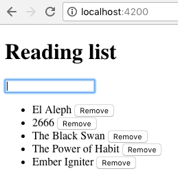
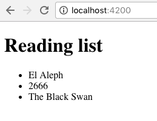
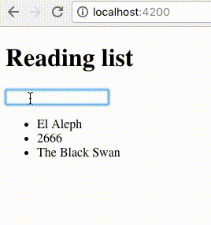
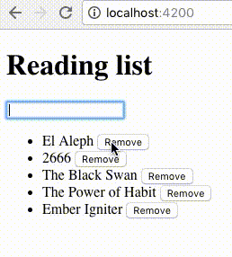

## Getting Started with Ember: A Reading List

Ember is fantastic for all kinds of frontend projects, but its sweet spot are medium/large real-world applications.

Its philosophy is reflected in phrases such as “Built for productivity”, “Don’t reinvent the wheel” and “Don’t waste time making trivial choices”.


In order to learn Ember we need to start small. That is exactly what we’ll do today.

We will build a reading list – not the most complex app ever built, but more than enough to learn its architecture and best practices.

## Ember CLI in a nutshell
Ember CLI is a command-line interface tool for creating and maintaining Ember apps. It’s essential for a productive development experience and, as such, **the starting point of any new app.** It shares common idioms and Ember’s philosophy of not reinventing the wheel.

Based on [Broccoli](https://github.com/broccolijs/broccoli) (an asset pipeline) it brings a lot to the table:

- ES6 syntax via Babel
- dependency management via [npm](https://www.npmjs.com/) and [Bower](https://bower.io/)
- file generators from blueprints
- static server with backend proxying and live browser reloading
- testing tools
- a [vibrant add-on ecosystem](http://www.emberaddons.com/)

Most importantly, it enforces a strong conventional project structure.

## Getting up and running
In order to install Ember CLI we need node and npm.

```
$ npm install -g ember-cli
```
Done?

Let’s make sure the ember command is ready to use:

```bash
$ ember -v
ember-cli: 2.13.2
node: 6.11.0
os: darwin x64
```
All set!

## Reading list app
Our goals are:

- build a reading-list component that lists, adds and removes books
- use that component as a widget at root URL (/), supplying it data and actions



Create the app!

```bash
$ ember new reading-list
installing app
  create .bowerrc
  create .editorconfig
  create .ember-cli
  # ...
Successfully initialized git.
Installed packages for tooling via npm.
Installed browser packages via Bower.
```
<div style="background-color: #ffbc00; padding:1em">
Ember is URL-driven. It is fundamentally important in Ember and it impacts all architectural decisions.
</div>

Starting from the / URL, we will create a route for this URL and its corresponding template:

```bash
$ cd reading-list
$ ember generate route application
installing route
  create app/routes/application.js
  create app/templates/application.hbs
installing route-test
  create tests/unit/routes/application-test.js
```

A route is a corresponding template. Let’s go step by step explaining what the ember generate route application just did for us:

**1) It added a routing definition in the router (app/router.js)**

```js
// app/router.js

Router.map(function() {
  this.route('application');
});
```
<div style="background-color: #ffbc00; padding:1em">
I opened the file and see no this.route('application')! What’s the deal?!

You’re right! One of Ember conventions (sometimes referred to as Ember magic) is having the application route mapped by default to the / root URL. This is exactly why I chose application.

So while this time we don’t see a route definition, any other route will. Had we requested ember generate route strawberries we would have found a this.route('strawberries') definition.

The default URL path for application is /. The default URL path for strawberries is /strawberries. Ember lets us override a default path like so:
</div>

```js
// app/router.js

Router.map(function() {
  this.route('strawberries', { path: '/sb' });
});
```
<div style="background-color: #ffbc00; padding:1em">
Paths may also contain parameters, like /strawberries/:id – but we will get to that later.
</div>

In essence, **the router maps URLs to their respective route handlers.**

2) ember generate **created the route** at app/routes/application.js

Based on information from the URL, the route will load and return a model (a model entity, an object) in a handler method named model(), like so:

```javascript
// app/routes/application.js

import Ember from 'ember';

export default Ember.Route.extend({

  model(/*params*/) {   // or model: function() {
    return retrieveModel();  // return your model
  }

});
```

<div style="background-color: #ffbc00; padding:1em">
model() is sometimes referred to as “the model() hook” because it’s a specific method invoked by the Ember framework every time it needs to handle a web request.
</div>

In other words, the route can be understood as a deserialization process from String to Object.

As the route has loaded a model, we will consider it the model data owner. Following best practices, it means that all data mutation and manipulation related to this model should be initiated by the owner.

3) ember generate created the associated template at app/templates/application.hbs

Templates are used to display model data in HTML using the Handlebars templating language. They receive the model loaded in the route as a parameter, model. We will shortly see how this works.

4) ember generate created a unit test file

We will discuss unit & integration testing in a later episode.

Let’s get our keyboard dirty!

## Step 1: Listing books
We boot up Ember:

```bash
$ ember server
Livereload server on http://localhost:49152
Serving on http://localhost:4200/
```

Visiting localhost:4200 will show an empty page (after all, our template is empty!)

Remember our goal?


We’ve got work to do!

Fire up your code editor and open the reading-list directory.

Return an actual model in the route

Let’s return data for our template to use.

```js
// app/routes/application.js

import Ember from 'ember';
import db from '../utils/db';

export default Ember.Route.extend({

  model() {
    return db.books();
  }

});
```

Our route’s model() hook returns a brand-new array with 3 default books from a pseudo-database located in ../utils/db:

```js
[
  { title: "El Aleph" },
  { title: "2666" },
  { title: "The Black Swan" }
]
```

<div style="background-color: #ffbc00; padding:1em">

For the sake of this example we use a small, ad-hoc, embedded “database” backed by a plain Javascript Array.

You will never do something like this in your Ember projects. It is however conducive to better explain Ember concepts. Paste the following in your project (or grab the file from here):

</div>

```js
// app/utils/db.js

import Ember from 'ember';

export default Ember.Object.create({

  _records: [
    { title: "El Aleph" },
    { title: "2666" },
    { title: "The Black Swan" }
  ],

  books() {
    return Ember.copy(this._records);
  },

  addBook(book) {
    this._records.push(book);
  },

  removeBook(book) {
    const index = this._records.indexOf(book);
    this._records.splice(index, 1);
  }

});
```
<div style="background-color: #ffbc00; padding:1em">
Models can be represented by any data structure. Real-world applications typically access data on a remote database behind an API.

Ember Data exists for this very reason. Tell-tale signs of its usage are:
<ul>
 <li>Routes returning this.store.findAll() or this.store.findRecord()
 <li>Model classes extending DS.Model placed in the app/models directory
</ul>
To keep things simple, this guide won’t cover Ember Data. We’ll leave it for the next instalment!
</div>


Show me the data!

The template receives the model parameter from the route. As we want to use a widget, we will pass the model into the component.

```js
{{! app/templates/application.hbs }}

<h1>Reading list</h1>

{{reading-list books=model}}

{{outlet}}
```
<div style="background-color: #ffbc00; padding:1em">
We will later see what {{outlet}} means. (Hint: it has to do with nested routes.)
</div>

Excellent. Before we try this out, we have to create the reading-list widget – our first Ember component!


(Ctrl+C will stop ember server if it was running.)

```bash
$ ember generate component reading-list
installing component
  create app/components/reading-list.js
  create app/templates/components/reading-list.hbs
installing component-test
  create tests/integration/components/reading-list-test.js
```

What did Ember CLI generate this time around?

The component’s Javascript
The component’s template
An integration test for the component
Let’s quickly edit the component’s template:

```html
{{! app/templates/components/reading-list.hbs }}

<ul>
{{#each books as |book|}}
  <li>{{ book.title }}</li>
{{/each}}
</ul>
```
It received an array of books, so we used the each helper to iterate over it!

<div style="background-color: #ffbc00; padding:1em">
Helpers are (typically) pure functions that work in Handlebars templates. Ember ships with a bunch of them, Ember add-ons may also provide some, and you can of course create your own! We won’t go into much detail but you will notice we use them fairly often. They are super helpful.
</div>

Run ember server (or ember s for short) again if you must.



##SUCCESS!

TODO: need good DDAU eplaination here

<div style="background-color: #ffbc00; padding:1em">
One-way data bindings are the most idiomatic way of developing Ember applications. In the spirit of React, this explicit data flow makes applications much easier to reason about and debug.
</div>

Step 2: Adding books
In the above graph, we notice the flow of data going up with actions.

This section will require the help of two add-ons contributed by the community. (Yet another reason why Ember CLI is awesome.)

In the reading-list directory run:

```bash
$ ember install ember-one-way-controls
Installed packages for tooling via npm.
Installed addon package.

$ ember install ember-route-action-helper
Installed packages for tooling via npm.
Installed addon package.
```

Congratulations, we installed our two first add-ons!

- ember-one-way-controls allows us to use one-way data bindings in our form inputs
- ember-route-action-helper lets us access actions in our route. Why do we need it? Remember that data changes should be performed by its owner? In our case the owner is the route

To be able to input a title, we have include a form input just before the books list:

```js
{{! app/templates/components/reading-list.hbs }}

{{one-way-input
  value
  update=(action (mut value))
  keyEvents=(hash
    13=(action 'onEnter')
  )
}}

<ul>
{{#each books as |book|}}
  <li>{{ book.title }}</li>
{{/each}}
</ul>
```

Okay, what’s going on?

- value: it is the property the input reads is value from
- update: the input sends updates to an action; in this case we are using the (mut value) helper “subexpression” which creates a mutator for that property. It really is a shorthand, it is the equivalent of calling (action 'updateValue') along with an action defined as:

```js
updateValue(value) {
  this.set('value', value);
}
```

- keyEvents: takes a hash (a key/value object) that maps keyCodes with actions. Very handy! We mapped 13 (enter key) to the onEnter action!

<div style="background-color: #ffbc00; padding:1em">
The Javascript portion of any component backs its template with data and actions. Any property or action that appears in the template is also available in Javascript and viceversa.

Regular templates (that is, not component templates) have backing Javascript files called Controllers.
</div>

The reading-list.js file therefore has to include the value property and the onEnter action:

```js
// app/components/reading-list.js

import Ember from 'ember';

export default Ember.Component.extend({

  value: "",

  actions: {

    onEnter(title) {
      if (title) {
        this.get('addBook')({ title });
      }
      this.set('value', "");  // reset value
    }

  }

});
```
Interesting! What is the onEnter action doing?

It’s calling a closure action – an action that was passed into the component like this:

```js
{{! app/templates/application.hbs }}

<h1>Reading list</h1>

{{reading-list books=model addBook=(route-action "addBook")}}

{{outlet}}
```
*“But why are we doing this? Why don’t we just add the book to the books property available to the component?”*

**Because we want to the data owner (the route) to perform the update.** The route-action helper that we previously installed enables us to do exactly that.

Here is the addBook action definition, in the route:

```js
// app/routes/application.js

import Ember from 'ember';
import db from '../utils/db';

export default Ember.Route.extend({

  model() {
    return db.books();
  },

  actions: {

    addBook(book) {
      db.addBook(book);
      this.refresh();
    }

  }

});
```
The addBook action simply does the appropriate database call and triggers this.refresh() because we want to stay in this same route.

Real-world apps normally use this.transitionTo(routeName, params) as they often need to navigate to another route and/or pass query parameters.

So, this.refresh() will trigger the route to reload, calling model() again. As the data flow graph reveals, the component re-renders once its books binding is updated.

This is the result:




## Step 3: Removing books
Remove can be similarly implemented:

1. Create the removeBook application route action:

```js
removeBook(book) {
  db.removeBook(book);
  this.refresh();
}
```
2. Pass removeBook into the component

```js
{{reading-list books=model addBook=(route-action "addBook") removeBook=(route-action "removeBook")}}
```
3. Place a button that triggers removeBook next to the title in the component template

```html
<li>{{ book.title }} <button {{action removeBook book}}>Remove</button></li>

{{!-- Important: removeBook goes without quotes. We are referencing the function directly, not looking it up with a string! --}}
```
## It works!
